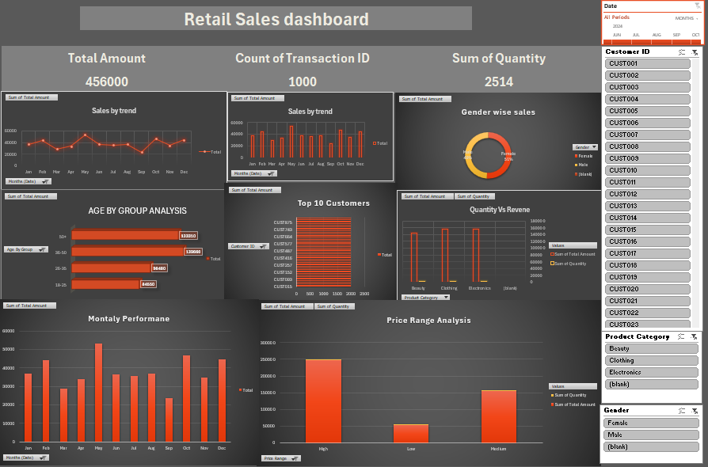

# Retail Sales Analysis

## Project Overview

This project analyzes retail sales data using Microsoft Excel and presents the results through an interactive dashboard.

## Dashboard

## Key Analysis

- Total Sales Amount
- Transaction Count
- Quantity Sold
- Sales Trend
- Gender-wise Sales
- Age Group Analysis
- Top 10 Customers
- Quantity vs Revenue
- Monthly Performance
- Price Range Analysis

## Tools Used

- Microsoft Excel
- Pivot Tables
- Pivot Charts
- Data Analysis
- Data Visualization
- Excel Dashboard

## Project Files

- `Retail_Sales_Analysis.xlsx` — Complete Excel project
- `dashboard.png` — Dashboard preview

## Objective

The objective of this project is to analyze retail sales data, identify customer and sales patterns, and present meaningful insights through an interactive Excel dashboard.
